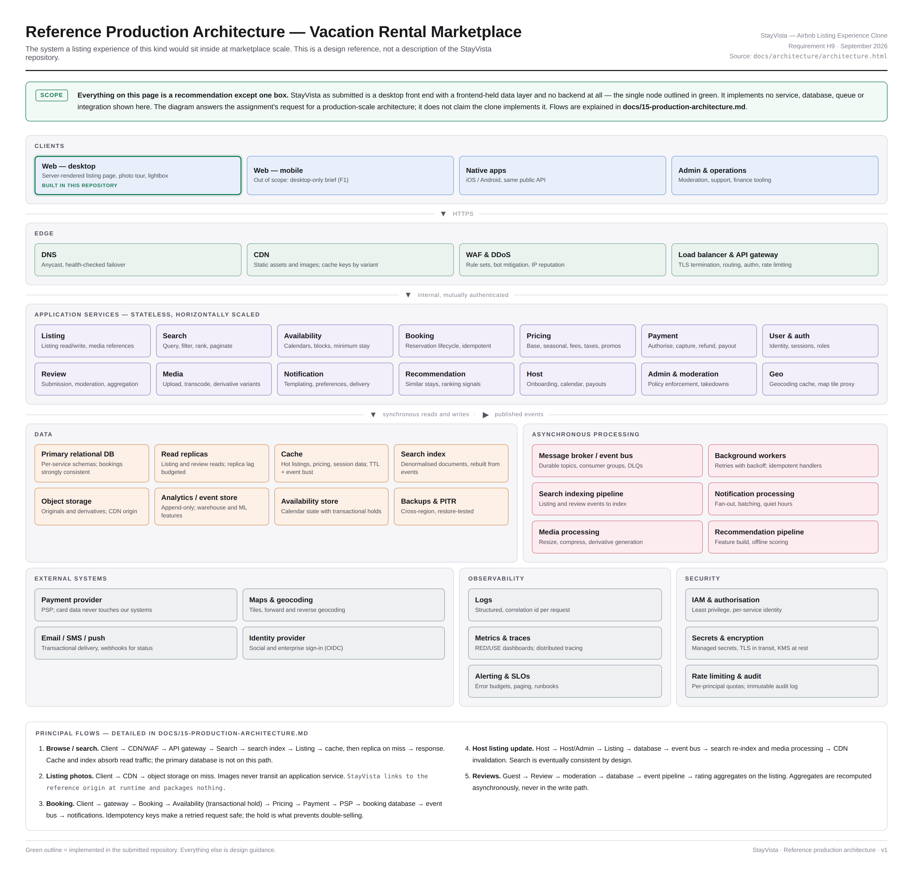

# StayVista — Vacation Rental Experience

**A carefully measured desktop hospitality interface, built around a seamless 43-photo browsing journey.**

StayVista is a production-style desktop vacation-rental experience built to reproduce the interaction patterns, visual hierarchy, and browsing flow of a modern hospitality marketplace. It is an independent, reference-driven frontend implementation—not an official Airbnb application.

**[Live Demo](https://stayvista-airbnb-clone.vercel.app)** · [Architecture](docs/architecture.pdf) · [Final validation report](docs/FINAL-SUBMISSION-REPORT.md) · [Development prompts](PROMPTS.md)

> **Release verified:** TypeScript, ESLint, production build, geometry, interaction, Photo Tour, Lightbox, release/E2E, accessibility and token checks passed. The public production deployment serves all 65 local image files successfully. This repository remains private under the assignment's submission restriction.

## Project Overview

The project concentrates on the details that make a listing feel coherent: stable photo geometry, a persistent browsing context across overlays, predictable keyboard controls, and a clear hierarchy of property information. Its three principal views—the listing, Photo Tour and Lightbox—share typed photo records and a controlled navigation model.

Measured geometry is checked automatically across desktop widths. Some visual tokens remain documented as provisional; a comprehensive pixel-perfect comparison with the live reference was not available.

## Key Features

| Area | Implemented experience |
| --- | --- |
| Listing | Desktop hero mosaic, property highlights, expandable description, amenities dialog and booking card |
| Photo Tour | Nine categories, thumbnail navigation, 43 ordered photos and category scrolling |
| Lightbox | Previous/next, arrow keys, Escape/close, category captions and position counter |
| Interaction | Focus restoration, nested-overlay focus ownership, scroll locking, calendar date selection and Save toggle |
| Property details | Host and co-hosts, reviews, Guest favourite, sleeping cards and supplied location map |
| Discovery | Eight nearby-stay cards with carousel navigation |
| Engineering | Reusable components, typed data, measured geometry harnesses and production architecture documentation |

Share and reservation controls are present in the interface, but do not implement a completed sharing service or booking transaction. These scope limits are explicit below.

## Product Experience

1. **Explore the listing.** Browse the hero composition, property details, sleeping arrangements, amenities, dates and reviews.
2. **Open the Photo Tour.** Show all photos reveals the categorized gallery. Category buttons scroll the complete collection rather than filtering away other rooms.
3. **Inspect a photo.** A gallery photo opens the Lightbox; hero tiles open their corresponding image with the tour beneath it.
4. **Navigate without losing context.** Previous/next buttons and arrow keys update the image, caption and counter. Escape returns to the tour; closing the tour restores listing focus and scroll position.

## Architecture

The implemented application is a Next.js frontend with local listing data and local assets. Reusable listing, booking, gallery and UI components are supported by focused hooks for gallery state, dialogs, keyboard navigation and scroll behavior.

The diagram below describes a **proposed production-scale vacation-rental marketplace**, including broader backend, storage, search and deployment infrastructure. Those services are architecture planning, not claims about services implemented in this frontend.



[Download architecture PDF](docs/architecture.pdf) · [Component architecture](docs/07-component-architecture.md) · [Data model](docs/08-data-model.md) · [Production architecture](docs/15-production-architecture.md)

## Technology Stack

| Layer | Technology |
| --- | --- |
| Framework | Next.js 15.5.26, App Router |
| UI | React 19.1.1 and React DOM 19.1.1 |
| Language | TypeScript 5.9, strict configuration |
| Styling | CSS, Tailwind CSS v4 and PostCSS |
| Code quality | ESLint 9, Next.js ESLint configuration, Prettier |
| Browser validation | Playwright/Chromium and esbuild harnesses, installed separately from application dependencies |
| Hosting | Vercel production deployment |

Next.js was patched from 15.5.4 to 15.5.26 for deployment compatibility. React and unrelated application dependencies were preserved.

## Project Structure

```text
src/
├── app/               # App Router entry points and global tokens
├── components/        # Layout, listing, booking, gallery and shared UI
├── data/              # Typed listing and ordered photo records
├── hooks/             # Gallery, dialog, keyboard and scroll behavior
├── lib/               # Types, utilities and image request coordination
└── styles/            # Component and layout stylesheets
public/
└── images/            # Supplied images and fictional avatar portraits
docs/                  # Decisions, measurements, provenance and architecture
scripts/               # Geometry, interaction, release and real-asset checks
.claude/               # Specialized agent and skill configurations
PROMPTS.md             # AI-assisted development record
```

## Image & Asset Strategy

All rendered images use local paths under `public/images/`, removing dependence on the previously failing external reference-image origin.

- **43 property JPEGs** came from the supplied `Hotel photo.zip`. The archive contained 43 files despite its earlier description as 41. Original records p01–p43, order and aspect ratios are preserved; supplied files were copied byte-for-byte.
- **Eight additional supplied files** came from `Other photo.zip`: six nearby-stay photographs, the Mirashya Homes logo and a static Candolim map.
- **14 original fictional adult portraits** provide eight co-host and six reviewer avatars. They do not depict the real people named in the interface. Avatars are optimized 160×160 WebP files.
- Sleeping cards reuse supplied photos p13 (Bedroom) and p01 (Living room). Nearby cards seven and eight reuse the second and fourth nearby images, following the saved reference's reuse pattern.
- The six nearby-photo/title associations are inferred from ZIP order and visible content; this uncertainty is recorded rather than presented as independently confirmed.

No replacement property photos were generated. Existing duplicate contents within the supplied property archive retain their original positions. Source provenance does not imply an independently verified redistribution license.

[Asset strategy](docs/13-asset-strategy.md) · [Property mapping](docs/supplied-photo-mapping.json) · [Additional mapping](docs/additional-asset-mapping.json) · [Avatar prompts](docs/synthetic-avatar-prompts.json)

## Accessibility

The implementation includes semantic landmarks and headings, image alternatives, labelled dialogs and controls, keyboard gallery navigation, focus trapping/restoration, inert background content and scroll locking. Calendar navigation and nested-overlay behavior are exercised by the interaction and release harnesses.

The final structural accessibility audit reported **zero problems**. This is a scoped automated result, not a claim of exhaustive WCAG certification or assistive-technology coverage.

[Accessibility plan](docs/05-accessibility-plan.md) · [Interaction map](docs/03-view-interaction-map.md)

## Performance

Local assets eliminate the reference origin's HTTP 429 dependency. The existing image component coordinates source assignment and prioritizes visible/nearby images; repeated sources share request state. Explicit image dimensions and preserved media boxes keep geometry predictable. The final build prerenders the listing route, while client components own interactive behavior.

The release build reported approximately **112 kB First Load JS** for the listing. All 65 production image responses returned HTTP 200 and matched local SHA-256 hashes. These are release observations, not Lighthouse or Core Web Vitals claims.

## Validation & Quality

Final results were recorded on 25 September 2026. The unchanged validation suite and actual-image browser check ran in Vercel's Linux build environment before the production release became Ready. Local TypeScript, lint and token checks also passed; Windows sandbox process restrictions prevented normal local build/harness execution in that environment.

<details>
<summary><strong>View verified release results</strong></summary>

| Check | Result |
| --- | --- |
| Dependency installation | PASS |
| TypeScript | PASS |
| ESLint | PASS |
| Next.js production build | PASS |
| Geometry | 66 assertions across 3 viewports |
| Interactions | 22 assertions |
| Photo Tour | 113 assertions |
| Lightbox | 100 assertions |
| Release/E2E | 110 assertions over 3 full cycles |
| Structural accessibility | Zero reported problems |
| Token/provenance | PASS |
| Existing image queue tests | PASS |
| Real-asset browser harness | All 43 tour and 43 Lightbox positions loaded |
| Public production images | 65/65 HTTP 200; byte hashes matched local files |

Production browser checks covered the listing, hero, sleeping cards, reviews, host/co-hosts, nearby carousel, map, Photo Tour and Lightbox navigation/close behavior.

</details>

[Full final report](docs/FINAL-SUBMISSION-REPORT.md) · [Measured geometry](docs/12-measurements.md) · [Visual fidelity limits](docs/14-visual-fidelity-note.md)

## Local Development

Use Node.js **20.9 or newer** and npm. No credentials or environment variables are required to run the frontend. Access to this private repository is required to clone it.

```bash
git clone https://github.com/arpan-dey-26/stayvista-vacation-rental-experience.git
cd stayvista-vacation-rental-experience
npm install
npm run dev
```

Open [localhost:3000](http://localhost:3000).

```bash
npm run typecheck
npm run lint
npm run build
npm run start
```

To run the browser harnesses, install their separate tooling without changing the project lockfile:

```bash
npm install --no-save --package-lock=false playwright esbuild
npx playwright install chromium
npm run verify:harness
node scripts/verify-image-queue.mjs
# Requires an existing production build:
node scripts/verify-assets.mjs
```

On Linux, Playwright may also require `npx playwright install-deps chromium`. Individual harness commands are listed in `package.json`.

## Production Deployment

**[Open the verified Vercel production release](https://stayvista-airbnb-clone.vercel.app)**

The existing deployment is Ready. Creating this repository does not redeploy or modify it. Future authorized releases can use the standard Vercel Next.js workflow after the quality gates pass; `scripts/verify-production-build.sh` records the full build-and-browser validation gate used for the final release.

## AI-Native Development Workflow

The workflow combines structured prompts, specialized agent/skill configuration, implementation review, automated geometry checks, accessibility and interaction testing, iterative browser verification and release validation. Measurements and provenance distinguish observed reference behavior from provisional decisions.

- [PROMPTS.md](PROMPTS.md) records the development sequence and final integration instructions.
- [.claude/agents](.claude/agents) and [.claude/skills](.claude/skills) preserve the project's specialized configurations.
- [docs/measure](docs/measure) preserves measurement probes and captured evidence.
- [scripts/verify-geometry](scripts/verify-geometry) contains executable checks against the real component tree.

AI assistance is documented as part of the process; test outcomes and runtime verification establish the final result.

## Engineering Decisions

| Decision | Reason |
| --- | --- |
| Shared, typed photo records | One source of truth for IDs, categories, hero selection and Lightbox order |
| Reusable UI and listing components | Keep presentation responsibilities focused and consistent |
| Explicit client boundaries | Interactive controls and hooks own browser state within the App Router structure |
| Deterministic overlay state | Preserve focus, scroll and browsing position across the listing/tour/viewer journey |
| Local supplied assets | Make image availability independent of a blocked third-party image origin |
| Measured CSS and provenance markers | Preserve established dimensions and document uncertain values |
| Separate geometry and real-image tests | Check layout independently, then verify actual image responses and decoding |
| Production-build validation | Validate deployable output alongside component-level behavior |

## Known Scope / Intentional Limitations

- Desktop scope only; a complete mobile experience is not implemented.
- This is a frontend demonstration. No real reservations, payments, authentication or marketplace backend are implemented.
- Save toggles interface state. Share, reservation and some other visible controls retain their existing placeholder behavior; a complete transactional booking flow is not claimed.
- The supplied map is a static image; its depicted controls are not an interactive mapping service.
- Review content and listing information are fixture data. Generated avatars are fictional and do not identify the named reviewers or co-hosts.
- Some visual tokens remain provisional. Historical planning documents may contain earlier blockers; the final report supersedes those release-status notes.

## License / Usage Note

This repository is private for assignment review. No open-source license or blanket permission to redistribute supplied photographs is granted. Code and assets remain subject to their respective rights and permissions. Do not publish the submission while the assignment restriction applies. StayVista is independent and is not affiliated with or endorsed by Airbnb.
